# terraform-module-hive-custom
Essa projeto é um exemplo de como podemos usar o Terraform null_resource para criar recurso que não está disponivel nativamente pelo
provider. Com Terraform null_resource o usuário pode customizar script local ou remoto para ser executado quando acontecer alguma
alteração no arquivo, parâmetro de configuração ou qualquer outra variável que queira usar com regra de disparo. 
Por si só, null_resource não tem a capacidade de fazer uma implantação na cloud, ficando sobre responsabilidade do script executar tal demanda.
Ele apenas gerencia o status de alteração do valor usado como regra de disparo. Se ao executar o 'terraform apply' e o valor atribuído
a regra de disparo não for alterado, o recurso não é acionado.

A documentação do Terraform não traz um exemplo claro do uso do null_resource. Então resolvi trazer um exemplo de como podemos usar
esse recurso para gerenciar as tabelas criadas no Hive Metastore. Veja a documentação do [Terraform null_resource](https://registry.terraform.io/providers/hashicorp/null/latest/docs/resources/resource).

Além da demonstração do uso do Terraform null_resource, esse projeto também usa o conceito de Terraform No-Code Modules.
O Terraform No-Code Modules permite que os usuários implantem recursos de infraestrutura sem ter o conhecimento da configuração do Terraform.
Isso permite que as organizações adotem um modelo de autoatendimento, oferecendo aos desenvolvedores com conhecimento limitado de infraestrutura
uma maneira de implantar os recursos de que precisam. Para mais informações acesse [Terraform No-Code Modules](https://developer.hashicorp.com/terraform/tutorials/cloud/no-code-provisioning).

## Objetivo Funcional

1. Oferecer para os usuários uma forma fácil de gerenciar as tabelas do Hive usando Terraform.

## Arquitetura

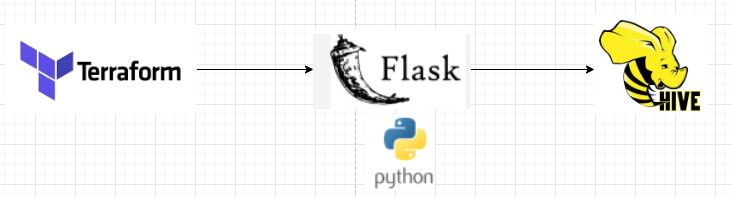

### Descrição da arquitetura

Modulo do Terraform criado para reuso. Quando o usuário executa 'terraform apply' e o arquivo sql 
é alterado ou executado pela primeira vez, o modulo hive realiza uma chamada de API para executar o script sql no Hive Server.

Essa arquitetura pode ser evoluída para ambiente de produção usando os serviços Serveless da AWS.

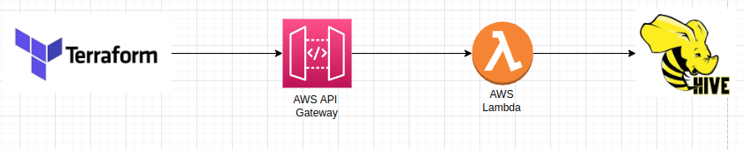

## Pré Requisitos

- [Instalação do docker + docker-compose](https://docs.solus.inf.br/display/TUT/Instalando+Docker+Engine+e+Docker+compose+no+Linux)
- [Instalação e configuração do Terraform](https://developer.hashicorp.com/terraform/tutorials/aws-get-started/install-cli)

## Deploy da Infra

1. Acesse o diretório hive.

    ```$ cd hive```


2. Construa imagem docker da API Flask.

    ```$ make build_image_api```


3. Deploy dos serviços Hadoop(Hive, HDFS) e API Flask.

   ```$ make create_container```


4. Certifique que os serviços da imagem abaixo foram provisionados.
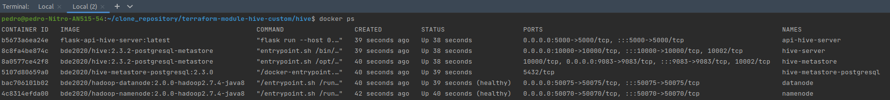

## Como usuário pode usar o modulo hive para criar/alterar/deletar as tabelas ?

Vou simular a criação de um database(ga8) e uma tabela(usuario).

1. Crie um arquivo sql na pasta SQL.
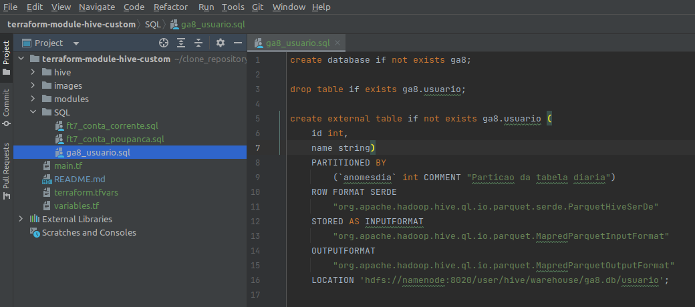


2. Em variables.tf, crie uma variável que faça referência ao arquivo sql que deseja fazer o deploy.
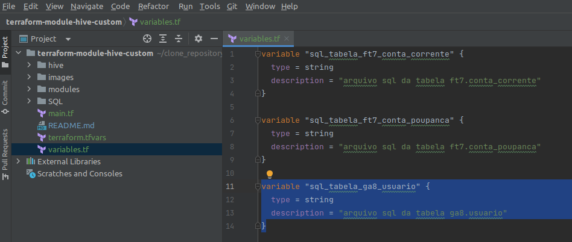


3. Em terraform.tfvars, defina o nome do arquivo sql que deseja fazer o deploy.
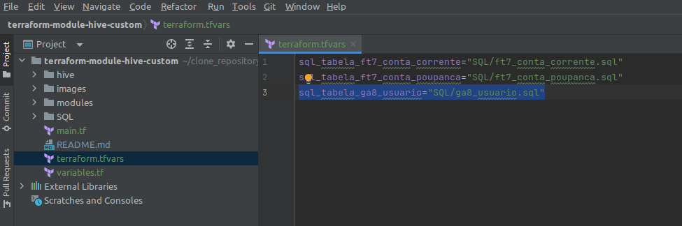


4. Em main.tf, crie um recurso usando o modulo hive.
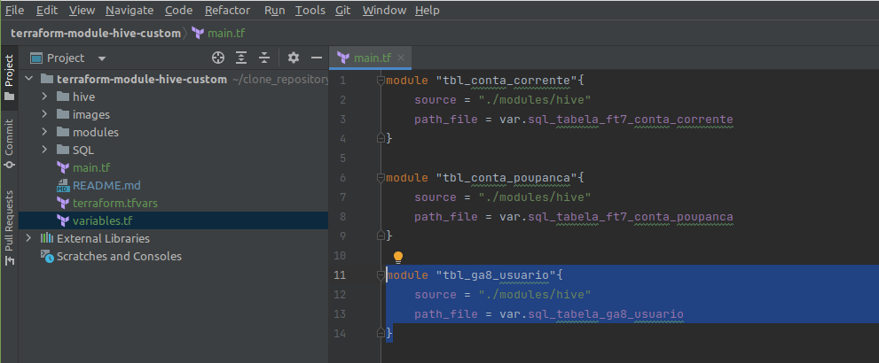

5. Na raiz do projeto, execute:

   - Para iniciar os modulos e instalação de plugins.

      ```$ terraform init```

   - Para identificar que um novo recurso foi criado para a tabela ga8.usuario.

      ```$ terraform plan```

      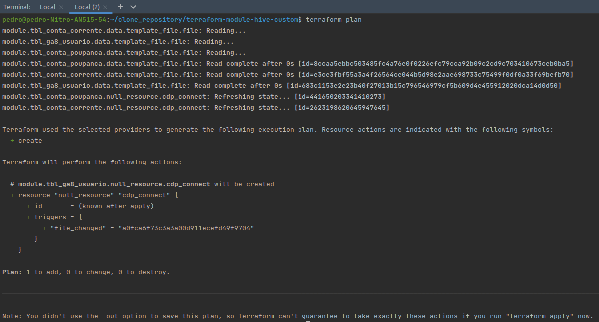

   - Deploy da nova tabela

      ```$ terraform apply -auto-approve```
      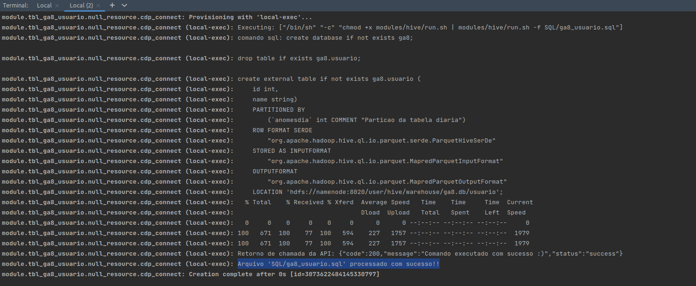


6. Valide se a tabela foi criada

      Entre no container hive-server

         $ docker exec -it hive-server /bin/bash
         $ hive
         $ show databases;
         $ show create table ga8.usuario;

    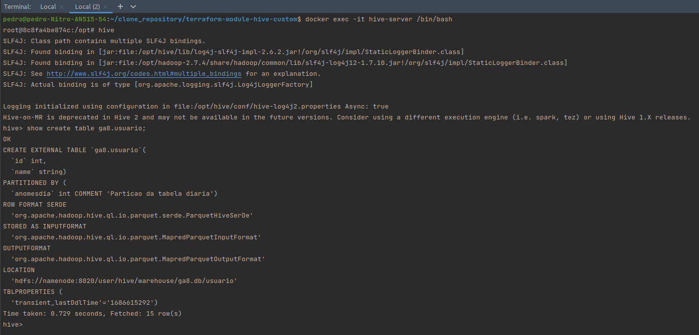

## Executando 'terraform apply' sem alteração ou criação de um novo recurso.

Como garantia o Terraform null_resource usa o arquivo terraform.tfstate para gerenciar os recursos que já foram provisionados.
Dessa forma, ao executar o comando 'terraform apply' sem alterar ou criar um novo recurso, o Terraform null_resource
não é acionado.

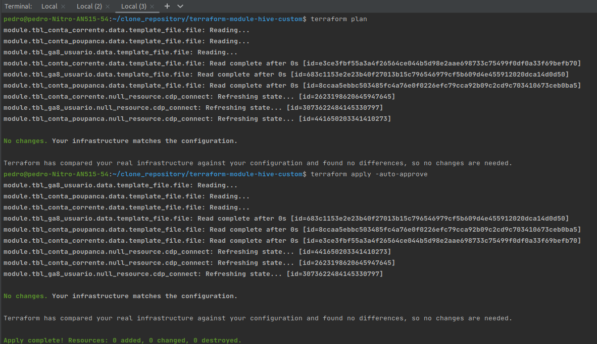


## Rerun para recurso finalizado com exit code 1
o Terraform null_resource espera que o recurso finalize o processamento com exit code 0 para que seja criado um hash no
arquivo terraform.tfstate, e dessa forma,  evitar que o mesmo recurso sejá provisionado novamente sem ter alteração. 
Caso o recurso finalize com exit code 1, ao executa o comando 'terraform apply' o terraform tentará provisionar o mesmo
recurso. Para que isso funcione, o script local ou remoto precisa encerrar a execução com exit code 0 em caso de processamento
realizado com sucesso, ou finalizar com exit code 1 em caso de falha.

Para simular esse comportamento, podemos forçar um erro de sintaxe de SQL do Hive(HQL).


